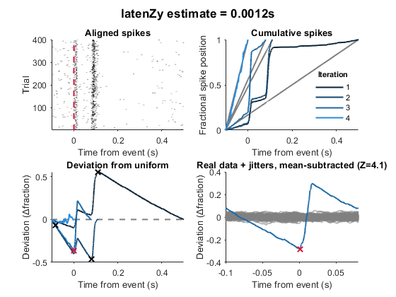
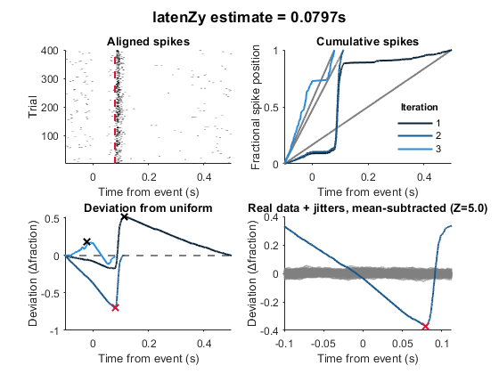
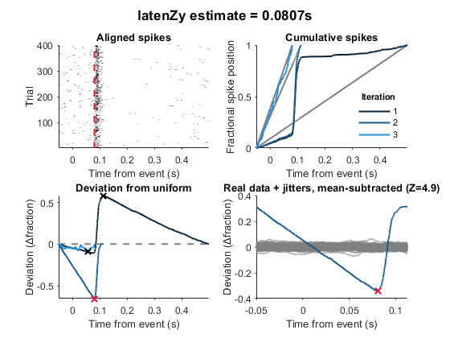

# *latenZy* — Preprocessing guidelines 
**Contents:** 
- Preparing trial-aligned data for ***latenZy***
- Using ***latenZy2*** with trial-aligned spike data
- Excluding a fixed window across event repetitions

## Preparing trial-aligned data for ***`latenZy`***
***`latenZy`*** requires spike and event times as continuous, absolute timestamps. If your data is trial-aligned (e.g., spikes relative to stimulus onset) and you do not have the original event times, you can simulate them by assigning large, fixed offsets between repetitions (e.g., 100s apart):

**Python example:**
```python
import numpy as np

#trial-aligned spike times for 5 trials (relative to stimulus onset)
aligned_spikes = [
    [-0.3, 0.2, 0.3, 0.7],
    [-0.4, 0.1, 0.5],
    [-0.6, 0.3, 0.6],
    [-0.2, 0.1, 0.4, 0.9],
    [-0.5, 0.6]
]

#simulated absolute event (stimulus) times, spaced 100s apart
event_times = np.arange(100, 100 * len(aligned_spikes) + 1, 100)

#offset each trial's spikes by its simulated global event time
new_spikes = []
for i, t_event in enumerate(event_times):
    new_spikes.append(np.array(aligned_spikes[i]) + t_event)

#flatten all spikes into a global spike time array
spike_times = np.concatenate(new_spikes)
```

**MATLAB example:**
```matlab
%trial-aligned spike times for 5 trials (relative to stimulus onset)
alignedSpikes = {
    [-0.3, 0.2, 0.3, 0.7];
    [-0.4, 0.1, 0.5];
    [-0.6, 0.3, 0.6];
    [-0.2, 0.1, 0.4, 0.9];
    [-0.5, 0.6]
};

%simulated absolute event (stimulus) times, spaced 100s apart
eventTimes = 100:100:(100 * numel(alignedSpikes));

%offset each trial's spikes by its simulated global event time
newSpikes = cell(size(alignedSpikes));
for i = 1:numel(alignedSpikes)
    newSpikes{i} = alignedSpikes{i} + eventTimes(i);
end

%flatten all spikes into a global spike time array
spikeTimes = [newSpikes{:}];
```

This produces pseudo-global spike and event times compatible with *`latenZy`*. 

In the first step of the algorithm, data is stitched across repetitions by removing spikes outside the event window `use_dur`/`useDur`. The excluded intervals between event repetiations are substracted from all subsequent times, creating a continuous timeline of only event-related activity for statistics. Make sure that `do_stitch`/`doStitch` is set to **True** (it is by default).
> ⚠️ **Important:** Make sure `use_dur`/`useDur` does **not** include periods without spikes, as silent intervals distort the stitched data and bias latency estimates.


## Using ***`latenZy2`*** with trial-aligned spike data
***`latenZy2`*** can directly analyze trial-aligned spike data without needing event times (because the statistics do not require jittering event times).
To do this:
- Pass the spike times for each trial in lists (Python) or cell arrays (MATLAB).
- Set event time inputs to empty lists/arrays ([ ]).
- Define the event window relative to stimulus (e.g., [0, 1] seconds).

**Python example:**
```python
latency, s_latenzy2 = latenzy2(spike_times1, [], spiketimes2, [], use_dur=[0, 1])
```

**MATLAB example:**
```matlab
[latency, sLatenzy2] = latenzy2(spikeTimes1, [], spikeTimes2, [], [0 1]);
```

## Excluding a fixed window across event repetitions
In certain situations, it is necessary to exclude a fixed time window relative to the event times, such as when stimulation artifacts are present. Simply removing all spikes within this window is insufficient, because  *`latenZy`* detects any deviations in spiking activity. Removing spikes in this way can create a time-locked decrease that may become significant under specific conditions. A better approach is to **remove the artifact period and stitch the remaining segments together**.

**Example:**<br>
<br>
*^The spikes between ~0-50ms are artifactual and interfere with latency estimation.*

<br>
*^Removing all spikes within this window creates another artifactual, time-locked deviation (peak in light blue curve).*

<br>
*^Removing all spikes and stitching the valid periods (by shifting spikes to the right<sup>†</sup>) overcomes this.*<br>  
<sup>†</sup>We shift spikes to the right in this case because we're interested in post-stimulation spiking activity, as is probably the case for most who encounter this situation.

**Here's an example of how to do this in MATLAB:**
```matlab
spikeTimes = ...
eventTimes = ...
useDur = [-0.1 0.5];      % Analysis window (relative to event)
cutWin = [0 0.05];        % Artifact window to exclude

%validate inputs
if isempty(spikeTimes) || isempty(eventTimes)
    error('Spike times or event times are empty');
end

%align spikes relative to each event (getRelSpikeTimes is a latenzy dependency)
[~, trialSpikes] = getRelSpikeTimes(spikeTimes, eventTimes, useDur);

%remove spikes inside artifact window for each trial
trialSpikesCut = cellfun(@(x) x(x < cutWin(1) | x > cutWin(2)), trialSpikes, 'UniformOutput', false);

%shift spikes before artifact window rightwards to close the gap
artifactDur = diff(cutWin);  % Duration of artifact window (positive scalar)
trialSpikesShifted = cellfun(@(x) [x(x < cutWin(1)) + artifactDur; x(x > cutWin(2))], trialSpikesCut, 'UniformOutput', false);

%convert shifted spikes back to absolute times and concatenate
allCleanSpikesCell = cell(size(trialSpikesShifted));
for i = 1:length(trialSpikesShifted)
    spikesRel = trialSpikesShifted{i};
    if ~isempty(spikesRel)
        allCleanSpikesCell{i} = spikesRel + eventTimes(i);
    else
        allCleanSpikesCell{i} = [];
    end
end
allCleanSpikes = sort(cell2mat(allCleanSpikesCell));

%adjust analysis window for compressed timeline (due to artifact removal)
adjustedUseDur = useDur;
if cutWin(2) > useDur(1) && cutWin(1) < useDur(2)
    adjustedUseDur(1) = useDur(1) + artifactDur;  % compress start of window
end

%estimate latency on cleaned spikes with restrictNeg=true
[latency, ~] = latenzy(allCleanSpikes, eventTimes, adjustedUseDur, [],[],[],[],[],[],true,1);
fprintf('Estimated latency (compressed timeline): %.4f s\n', latency);

%adjust latency back to original timeline if possible
if isnan(latency)
    fprintf('No significant latency detected\n');
    adjustedLatency = NaN;
elseif latency <= cutWin(1) + artifactDur
    adjustedLatency = latency - artifactDur;
    fprintf('Adjusted latency (original timeline, before artifact window): %.4f s\n', adjustedLatency);
elseif latency >= cutWin(2)
    adjustedLatency = latency;
    fprintf('Adjusted latency (original timeline, after artifact window): %.4f s\n', adjustedLatency);
else
    fprintf('Latency falls within artifact window and cannot be accurately mapped\n');
    adjustedLatency = NaN;
end
```


